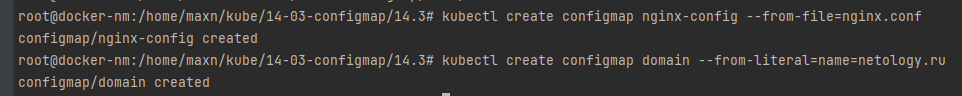
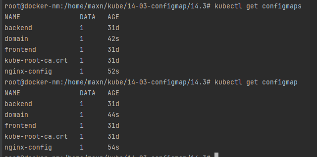
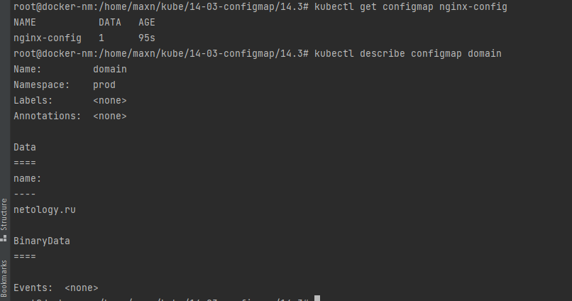
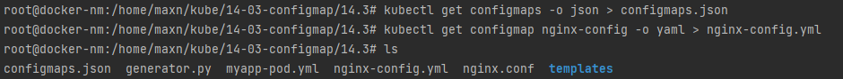
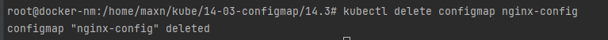
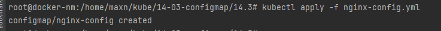

# 14-03-configmap

### Создание карты конфигураций



### Список карт



### Просмотр карты



### Выгрузить карту в yaml

```shell
root@docker-nm:/home/maxn/kube/14-03-configmap/14.3# kubectl get configmap nginx-config -o yaml
apiVersion: v1
data:
  nginx.conf: |
    server {
        listen 80;
        server_name  netology.ru www.netology.ru;
        access_log  /var/log/nginx/domains/netology.ru-access.log  main;
        error_log   /var/log/nginx/domains/netology.ru-error.log info;
        location / {
            include proxy_params;
            proxy_pass http://10.10.10.10:8080/;
        }
    }
kind: ConfigMap
metadata:
  creationTimestamp: "2022-05-25T09:07:09Z"
  name: nginx-config
  namespace: prod
  resourceVersion: "6829291"
  uid: 2ae72b42-45e7-4947-9b21-d9cdcd54cc24

```

### Выгрузить карту в json

```shell
root@docker-nm:/home/maxn/kube/14-03-configmap/14.3# kubectl get configmap domain -o json
{
    "apiVersion": "v1",
    "data": {
        "name": "netology.ru"
    },
    "kind": "ConfigMap",
    "metadata": {
        "creationTimestamp": "2022-05-25T09:07:19Z",
        "name": "domain",
        "namespace": "prod",
        "resourceVersion": "6829305",
        "uid": "2a2907f3-d91b-44c2-a8b2-94e5d13f5d89"
    }
}
```

### Выгрузка карты в файл



### Удаление карты 



### Загрузка карты из файла

